<!--
  ⚠️ SETUP — read this before uploading
  1. Replace every "YOUR-USERNAME" below with your actual GitHub username.
  2. Replace the LinkedIn / email / portfolio placeholders near the bottom.
  3. This file must live in a repo named exactly YOUR-USERNAME/YOUR-USERNAME
     (create a new public repo with that name, add this as README.md).
  4. Upload terminal.svg to the SAME repo, next to this README, so the
      line below can find it.
-->

 

 

## 🛠️ Tech Stack

 

## 🧑‍💻 What I'm Building

<table>
  <tr>
    <td width="33%" valign="top">
      <h3>🚀 Netpoint</h3>
      
My standout project — a <b>live, deployed SaaS platform</b>. This is the one I lead with in interviews.

      

        
        
      

    </td>
    <td width="33%" valign="top">
      <h3>✅ Task Tracker</h3>
      
A personal productivity app with a <b>GitHub-style heatmap</b>, recurring task templates, and carry-forward prompts.

      

        
        
      

    </td>
    <td width="33%" valign="top">
      <h3>📇 Cold-Calling CRM</h3>
      
A lead-tracking CRM for cold outreach, with a <b>color-coded status system</b> for leads sourced from Google Maps.

      

        
        
      

    </td>
  </tr>
</table>

 

## 📫 Let's Connect

